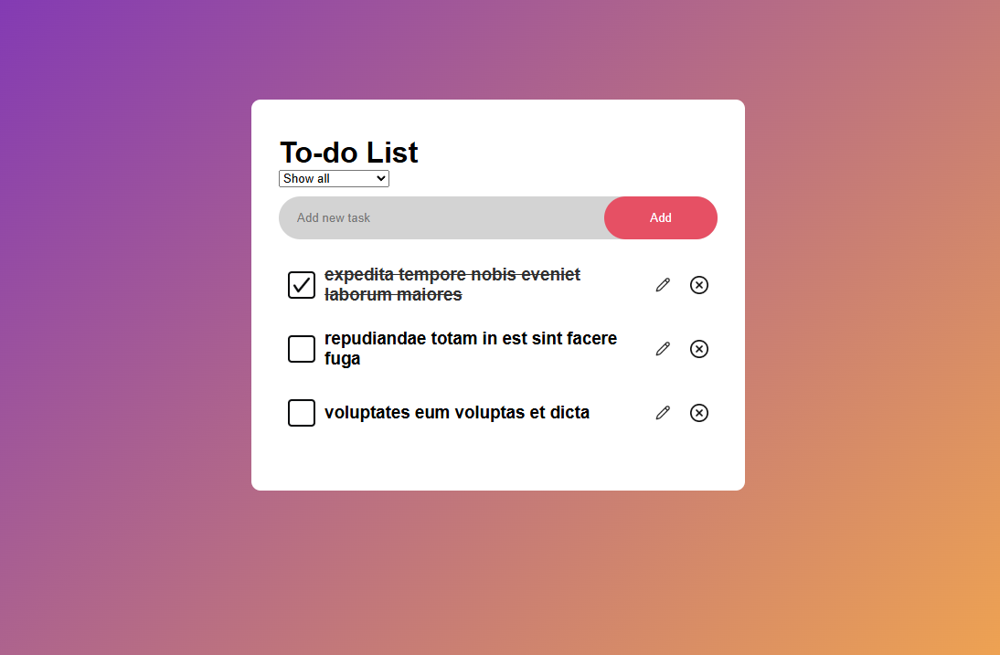

# Coding-Challenge

Todo List Next.js application written in TypeScript

## Getting Started

To run the project locally:

```bash
git clone https://github.com/your-username/your-repo-name.git
cd to-do-app
npm install
npm run dev
```

# Screenshot

